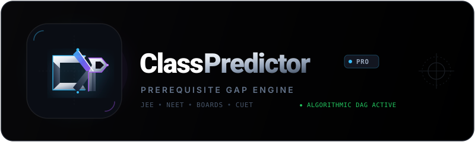

<div align="center">

  

  <br />

  <p align="center">
    <strong>Algorithmic Prerequisite Diagnostic & Bottleneck Engine for Class 11 & 12</strong>
  </p>

  <p align="center">
    <a href="https://parth-goyal.vercel.app">
      
    </a>
    
    
  </p>

  <p align="center">
    <em>"Know exactly what Class 11 will hit you with — before you struggle."</em>
  </p>

</div>

---

## ⚡ Overview

**ClassPredictor** is an algorithmic diagnostic system built for secondary school students transitioning from Class 10 to Class 11 & 12 across Science (PCM / PCB) and Commerce streams.

By analyzing student-rated foundations across Class 9–10 syllabi, ClassPredictor computes a **Directed Acyclic Graph (DAG)** of prerequisite dependencies to forecast downstream bottlenecks, compute exam-specific risk scores for **JEE**, **NEET**, **CBSE Boards**, and **CUET**, and prescribe tailored remediation roadmaps.

---

## 💎 Features

- **Directed Prerequisite Graph (D3.js)**: Interactive topological visualization of knowledge foundations connecting Class 9–10 roots to Class 11–12 nodes.
- **Predictive Risk Engine**: Multi-tier weighted risk stratification (Critical, Elevated, Baseline) tuned specifically for target competitive exams.
- **Prioritization Matrix**: 4-quadrant decision matrix (Must Master, Fast Review, Easy Wins, Low Impact) to maximize prep efficiency.
- **Phased Tactical Roadmap**: Concrete, sequenced study plan with calculated preparation hours.
- **Extreme Premium Dark UI**: Obsidian blacks (`#000000`), subtle micro-grid canvas, titanium beveled glyphs, and Vercel-style spotlights.
- **Live Telemetry & Feedback**: Real-time Firebase Firestore database telemetry and automated EmailJS alerts.

---

## 🛠 Tech Stack

- **Framework**: React 19 + Vite 8
- **Visualization**: D3.js (Force-directed Prerequisite Graph)
- **Database**: Firebase Firestore
- **Alerts & Notifications**: EmailJS
- **Typography & Icons**: Geist & Geist Mono, Lucide React
- **Celebration Engine**: Canvas Confetti

---

## 🚀 Getting Started

```bash
# Clone the repository
git clone https://github.com/parthgoyal379/classpredictor.git

# Navigate into directory
cd classpredictor

# Install dependencies
npm install

# Start local development server
npm run dev

# Build for production
npm run build
```

---

## 🛡 License & Creator

Engineered with precision by **[Parth Goyal](https://parth-goyal.vercel.app)**.  
Email: [parthgoyal379@gmail.com](mailto:parthgoyal379@gmail.com)
